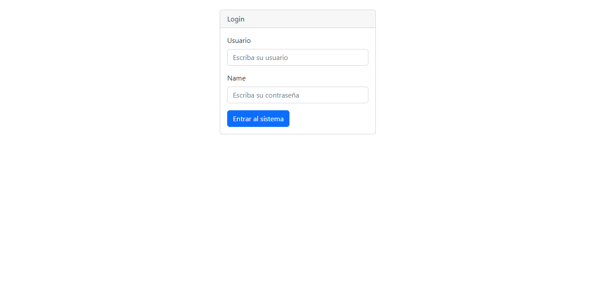

# Proyecto ABM Empleados

El siguiente proyecto representa la simulacion de un ABM de empleados, en el cual un usuario podra loguearse, añadir empleados, controlar todos los usuarios y cerrar seccion.

Esta practica se realizo con el fin de hacer un repaso general de todo lo que se aprendio del lenguaje PHP.

Estoy seguro de que se trata de un proyecto simple, pero considero que es el comienzo de un gran camino.

## imagenes:

